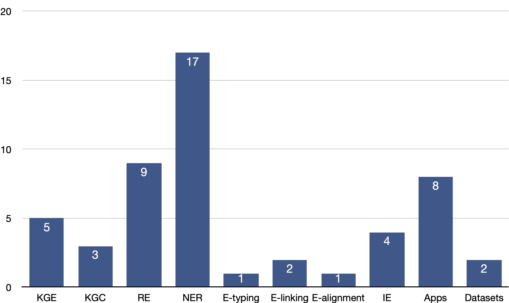

# Knowledge Graphs, Information Extraction and Knowledge-aware NLP @ACL20

Here lists papers and quick notes about knowledge graphs, information extraction, and knowledge-aware NLP applications that appear in the 58th Annual Meeting of the Association for Computational Linguistics (ACL 2020). 
Knowledge graph embedding and completion are still hot topics. Named entity recognition is the most extensively studied topic in this year's ACL conference, with 17 papers accepted. Knowledge-aware or knowledge-guided applications such as sentiment analysis and text generation are also exciting directions. 

- [Knowledge Graphs, Information Extraction and Knowledge-aware NLP @ACL20](#knowledge-graphs-information-extraction-and-knowledge-aware-nlp-acl20)
  - [Knowledge Graph Embedding](#knowledge-graph-embedding)
  - [Knowledge Graph Completion](#knowledge-graph-completion)
  - [Relation Extraction](#relation-extraction)
  - [Named Entity Recognition](#named-entity-recognition)
  - [Entity Typing](#entity-typing)
  - [Entity Linking](#entity-linking)
  - [Entity Alignment](#entity-alignment)
  - [Information Extraction](#information-extraction)
  - [Knowledge-aware Applications](#knowledge-aware-applications)
    - [Question Answering](#question-answering)
    - [Sentiment Analysis](#sentiment-analysis)
    - [Generation](#generation)
  - [Dataset](#dataset)

## Knowledge Graph Embedding
__Low-Dimensional Hyperbolic Knowledge Graph Embeddings__
_Ines Chami, Adva Wolf, Da-Cheng Juan, Frederic Sala, Sujith Ravi and Christopher Ré_ [[Paper](https://arxiv.org/abs/2005.00545)] [[Code](https://github.com/tensorflow/neural-structured-learning/tree/master/research/kg_hyp_emb)]
> hyperbolic embedding for high-fidelity and parsimonious representations;  
> simultaneously capture hierarchical and logical patterns;  
> hyperbolic reflections and rotations with attention to model complex relational patterns  

__Orthogonal Relation Transforms with Graph Context Modeling for Knowledge Graph Embedding__. 
_Yun Tang, Jing Huang, Guangtao Wang, Xiaodong He and Bowen Zhou_ [[Paper](https://arxiv.org/abs/1911.04910)]
> extend the RotatE from 2D complex domain to high dimensional space with orthogonal transforms;  
> graph context is integrated into distance scoring functions

__SEEK: Segmented Embedding of Knowledge Graphs__
_Wentao Xu, Shun Zheng, Liang He, Bin Shao, Jian Yin, Tie-Yan Liu_. [[Paper](https://arxiv.org/abs/2005.00856)] [[Code](https://github.com/Wentao-Xu/SEEK)]
> lightweight modeling framework  
> 1) facilitating sufficient feature interactions;  
> 2) preserving both symmetry and antisymmetry properties of relations.

__ReInceptionE: Relation-Aware Inception Network with Joint Local-Global Structural Information for Knowledge Graph Embedding__
_Zhiwen Xie, Guangyou Zhou, Jin Liu and Jimmy Xiangji Huang_. [[Paper](https://www.aclweb.org/anthology/2020.acl-main.526.pdf)]
> Inception network to learn query embedding, aiming to increase the interaction between head and relation embeddings;  
> a relation-aware attention mechanism to enrich the query embedding with the local neighborhood and global entity information

__Knowledge Graph Embedding Compression__
_Mrinmaya Sachan_. [[Paper](https://www.aclweb.org/anthology/2020.acl-main.238.pdf)]
> compresses the KG embedding layer by representing each entity in the KG as a vector of discrete codes and then composes the embeddings from these codes

## Knowledge Graph Completion 
__NeuInfer: Knowledge Inference on N-ary Facts__
_Saiping Guan, Xiaolong Jin, Jiafeng Guo, Yuanzhuo Wang and Xueqi Cheng_. [[Paper](http://www.bigdatalab.ac.cn/~gjf/papers/2020/ACL.pdf)]
> represent each n-ary fact as a primary triple coupled with a set of its auxiliary descriptive attribute-value pair(s)

__Can We Predict New Facts with Open Knowledge Graph Embeddings? A Benchmark for Open Link Prediction__
_Samuel Broscheit, Kiril Gashteovski, Yanjie Wang and Rainer Gemulla_. [[Paper](https://www.uni-mannheim.de/media/Einrichtungen/dws/Files_People/Profs/rgemulla/publications/broscheit20-olpbench.pdf)]
> open knowledge graph, a benchmark for open link prediction: OLPBENCH

__A Re-evaluation of Knowledge Graph Completion Methods__
_Zhiqing Sun, Shikhar Vashishth, Soumya Sanyal, Partha Talukdar and Yiming Yang_. [[Paper](https://arxiv.org/abs/1911.03903)]
> an evaluation protocol for handling bias in the model

## Relation Extraction
__A Novel Cascade Binary Tagging Framework for Relational Triple Extraction__
_Zhepei Wei, Jianlin Su, Yue Wang, Yuan Tian and Yi Chang_.
[[Paper](https://arxiv.org/pdf/1909.03227.pdf)] [[Code](https://github.com/weizhepei/CasRel)]
> models relations as functions that map subjects to objects in a sentence

__Dialogue-Based Relation Extraction__
_Dian Yu, Kai Sun, Claire Cardie and Dong Yu_. [[Paper](https://arxiv.org/pdf/2004.08056.pdf)] [[Code+data](https://dataset.org/dialogre/)]
> the first human-annotated dialogue-based relation extraction dataset DialogRE;  
> a new metric 

__Exploiting the Syntax-Model Consistency for Neural Relation Extraction__
_Amir Pouran Ben Veyseh, Franck Dernoncourt, Dejing Dou and Thien Huu Nguyen_. [[Paper](https://www.aclweb.org/anthology/2020.acl-main.715.pdf)]
> uses the dependency trees to extract the syntax-based importance scores for the words, serving as a tree representation to introduce syntactic information into the models with greater generalization.

__Probing Linguistic Features of Sentence-Level Representations in Relation Extraction__
_Christoph Alt, Aleksandra Gabryszak and Leonhard Hennig_ [[Paper](https://arxiv.org/pdf/2004.08134.pdf)]
> 14 probing tasks specifically focused on linguistic properties relevant to relation extraction
> four encoder architectures

__Reasoning with Latent Structure Refinement for Document-Level Relation Extraction__
_Guoshun Nan, Zhijiang Guo, Ivan Sekulic and Wei Lu_ [[Paper](https://arxiv.org/pdf/2005.06312.pdf)]
> empowers the relational reasoning across sentences by automatically inducing the latent document-level graph;  
> a refinement strategy, which enables the model to incrementally aggregate relevant information for multi-hop reasoning

__Relabel the Noise: Joint Extraction of Entities and Relations via Cooperative Multiagents__
_Daoyuan Chen, Yaliang Li, Kai Lei and Ying Shen_ [[Paper](https://arxiv.org/pdf/2004.09930.pdf)]
> consider the problem of shifted label distribution;  
> jointly extract entity and relation through a group of cooperative multiagents

__TACRED Revisited: A Thorough Evaluation of the TACRED Relation Extraction Task__
_Christoph Alt, Aleksandra Gabryszak and Leonhard Hennig_ [[Paper](https://arxiv.org/abs/2004.14855)]

__Towards Understanding Gender Bias in Relation Extraction__
_Andrew Gaut, Tony Sun, Shirlyn Tang, Yuxin Huang, Jing Qian, Mai ElSherief, Jieyu Zhao, Diba Mirza, Elizabeth Belding, Kai-Wei Chang and William Yang Wang_. [[Paper](https://www.aclweb.org/anthology/2020.acl-main.265.pdf)]

__Relation Extraction with Explanation__
_Hamed Shahbazi, Xiaoli Fern, Reza Ghaeini and Prasad Tadepalli_. [[Paper](https://www.aclweb.org/anthology/2020.acl-main.579.pdf)]

## Named Entity Recognition
__A Unified MRC Framework for Named Entity Recognition__
_Xiaoya Li, Jingrong Feng, Yuxian Meng, Qinghong Han, Fei Wu and Jiwei Li_ [[Paper](https://arxiv.org/pdf/1910.11476.pdf)] [[Code](https://github.com/ShannonAI/mrc-for-flat-nested-ner)]
> formulate NER as a machine reading comprehension task

__An Effective Transition-based Model for Discontinuous NER__
_Xiang Dai, Sarvnaz Karimi, Ben Hachey and Cecile Paris_. [[Paper](https://arxiv.org/pdf/2004.13454.pdf)]
> a simple, effective transition-based model with generic neural encoding for discontinuous NER.

__Bipartite Flat-Graph Network for Nested Named Entity Recognition__
_Ying Luo and Hai Zhao_ [[Paper](https://arxiv.org/pdf/2005.00436.pdf)]
> BiLSTM + GCN to learn flat entities and their inner dependencies

__Code and Named Entity Recognition in StackOverflow__
_Jeniya Tabassum, Mounica Maddela, Wei Xu and Alan Ritter_ [[Paper](https://arxiv.org/abs/2005.01634)]

__Improving Multimodal Named Entity Recognition via Entity Span Detection with Unified Multimodal Transformer__
_Jianfei Yu, Jing Jiang, Li Yang and Rui Xia_. [[Paper](https://www.aclweb.org/anthology/2020.acl-main.306.pdf)] 

__Multi-Cell Compositional LSTM for NER Domain Adaptation__
_Chen Jia and Yue Zhang_. [[Paper](https://www.aclweb.org/anthology/2020.acl-main.524.pdf)] 

__Named Entity Recognition without Labelled Data: A Weak Supervision Approach__
_Pierre Lison, Jeremy Barnes, Aliaksandr Hubin and Samia Touileb_ [[Paper](https://arxiv.org/pdf/2004.14723.pdf)]
> a broad spectrum of labelling functions to automatically annotate texts from the target domain;  
> a hidden Markov model which captures the varying accuracies and confusions of the labelling functions

__Simplify the Usage of Lexicon in Chinese NER__
_Ruotian Ma, Minlong Peng, Qi Zhang, Zhongyu Wei and Xuanjing Huang_ [[Paper](https://arxiv.org/abs/1908.05969)]
> Use Lexicon for Chinese NER as simply as possible

__Single-/Multi-Source Cross-Lingual NER via Teacher-Student Learning on Unlabeled Data in Target Language__
_Qianhui Wu, Zijia Lin, Börje Karlsson, Jian-Guang Lou and Biqing Huang_ [[Paper](https://arxiv.org/abs/2004.12440)]

__Sources of Transfer in Multilingual Named Entity Recognition__
_David Mueller, Nicholas Andrews and Mark Dredze_ [[Paper](https://arxiv.org/abs/2005.00847)]

__Temporally-Informed Analysis of Named Entity Recognition__
_Shruti Rijhwani and Daniel Preotiuc-Pietro_. [[Paper](https://www.aclweb.org/anthology/2020.acl-main.680.pdf)]

__FLAT: Chinese NER Using Flat-Lattice Transformer__
_Xiaonan Li, Hang Yan, Xipeng Qiu and Xuanjing Huang_ [[Paper](https://arxiv.org/abs/2004.11795)]

__Improving Low-Resource Named Entity Recognition using Joint Sentence and Token Labeling__
_Canasai Kruengkrai, Thien Hai Nguyen, Sharifah Mahani Aljunied and Lidong Bing_. [[Paper](https://www.aclweb.org/anthology/2020.acl-main.523.pdf)]

__Instance-Based Learning of Span Representations: A Case Study through Named Entity Recognition__
_Hiroki Ouchi, Jun Suzuki, Sosuke Kobayashi, Sho Yokoi, Tatsuki Kuribayashi, Ryuto Konno and Kentaro Inui_ [[Paper](https://arxiv.org/abs/2004.14514)]

__Named Entity Recognition as Dependency Parsing__
_Juntao Yu, Bernd Bohnet and Massimo Poesio_. [[Paper](https://www.aclweb.org/anthology/2020.acl-main.577.pdf)]

__Soft Gazetteers for Low-Resource Named Entity Recognition__
_Shruti Rijhwani, Shuyan Zhou, Graham Neubig and Jaime Carbonell_. [[Paper](https://www.aclweb.org/anthology/2020.acl-main.722.pdf)]

__TriggerNER: Learning with Entity Triggers as Explanations for Named Entity Recognition__
_Bill Yuchen Lin, Dong-Ho Lee, Ming Shen, Ryan Moreno, Xiao Huang, Prashant Shiralkar and Xiang Ren_. [[Paper](https://www.aclweb.org/anthology/2020.acl-main.752.pdf)]

## Entity Typing 
__Hierarchical Entity Typing via Multi-level Learning to Rank__
ACL 2020. _Chen et al._ [[Paper](https://arxiv.org/abs/2004.02286)] 
> hierarchical entity classification; training: multi-level learning-to-rank loss; prediction: coarse-to-fine decoder 

__Connecting Embeddings for Knowledge Graph Entity Typing__
_Yu Zhao, Anxiang zhang, Ruobing Xie, Kang Liu and Xiaojie WANG_. [[Paper](https://www.aclweb.org/anthology/2020.acl-main.572.pdf)]

## Entity Linking
__From Zero to Hero: Human-In-The-Loop Entity Linking in Low Resource Domains__
_Jan-Christoph Klie, Richard Eckart de Castilho and Iryna Gurevych_. [[Paper](https://www.aclweb.org/anthology/2020.acl-main.624.pdf)]

__Improving Entity Linking through Semantic Reinforced Entity Embeddings__
_Feng Hou, Ruili Wang, Jun He and Yi Zhou_. [[Paper](https://www.aclweb.org/anthology/2020.acl-main.612.pdf)]

## Entity Alignment
__Neighborhood Matching Network for Entity Alignment__
_Yuting Wu, Xiao Liu, Yansong Feng, Zheng Wang and Dongyan Zhao_ [[Paper](https://arxiv.org/pdf/2005.05607.pdf)]

## Information Extraction
__A Joint Neural Model for Information Extraction with Global Features__
_Ying Lin, Heng Ji, Fei Huang and Lingfei Wu_ [[Paper](https://blender.cs.illinois.edu/paper/jointiesentence2020.pdf)]
> extract the globally optimal IE result as a graph from an input sentence.

__IMoJIE: Iterative Memory-Based Joint Open Information Extraction__
_Keshav Kolluru, Samarth Aggarwal, Vipul Rathore, Mausam and Soumen Chakrabarti_ [[Paper](https://arxiv.org/pdf/2005.08178.pdf)]
> an extension to CopyAttention; produces the next extraction conditioned on all previously extracted tuples

__TXtract: Taxonomy-Aware Knowledge Extraction for Thousands of Product Categories__
_Giannis Karamanolakis, Jun Ma and Xin Luna Dong_. [[Paper](https://www.aclweb.org/anthology/2020.acl-main.751.pdf)]

__Improving Event Detection via Open-domain Trigger Knowledge__
_Meihan Tong, Bin Xu, Shuai Wang, Yixin Cao, Lei Hou, Juanzi Li and Jun Xie_. [[Paper](https://www.aclweb.org/anthology/2020.acl-main.522.pdf)]

## Knowledge-aware Applications

### Question Answering
__Improving Multi-hop Question Answering over Knowledge Graphs using Knowledge Base Embeddings__.
_Apoorv Saxena, Aditay Tripathi and Partha Talukdar_ [[Paper](https://malllabiisc.github.io/publications/papers/final_embedkgqa.pdf)] [[Code](https://github.com/malllabiisc/EmbedKGQA)]

### Sentiment Analysis
__KinGDOM: Knowledge-Guided DOMain adaptation for sentiment analysis__
_Deepanway Ghosal, Devamanyu Hazarika, Abhinaba Roy, Navonil Majumder, Rada Mihalcea and Soujanya Poria_. [[Paper](https://www.aclweb.org/anthology/2020.acl-main.292.pdf)]

__Enhancing Cross-target Stance Detection with Transferable Semantic-Emotion Knowledge__
_Bowen Zhang, Min Yang, Xutao Li, Yunming Ye, Xiaofei Xu and Kuai Dai_. [[Paper](https://www.aclweb.org/anthology/2020.acl-main.291.pdf)]

__SKEP: Sentiment Knowledge Enhanced Pre-training for Sentiment Analysis__
_Hao Tian, Can Gao, Xinyan Xiao, Hao Liu, Bolei He, Hua Wu, Haifeng Wang and Feng Wu_. [[Paper](https://www.aclweb.org/anthology/2020.acl-main.374.pdf)]

### Generation
__Generating Informative Conversational Response using Recurrent Knowledge-Interaction and Knowledge-Copy__
_Xiexiong Lin, Weiyu Jian, Jianshan He, Taifeng Wang and Wei Chu_. [[Paper](https://www.aclweb.org/anthology/2020.acl-main.6.pdf)]

__Grounded Conversation Generation as Guided Traverses in Commonsense Knowledge Graphs__
_Houyu Zhang, Zhenghao Liu, Chenyan Xiong and Zhiyuan Liu_. [[Paper](https://www.aclweb.org/anthology/2020.acl-main.184.pdf)] [[Code](https://github.com/thunlp/ConceptFlow)]

__Semantic Graphs for Generating Deep Questions__
_Liangming Pan, Yuxi Xie, Yansong Feng, Tat-Seng Chua and Min-Yen Kan_ [[Paper](https://arxiv.org/pdf/2004.12704.pdf)] [[Code](https://github.com/WING-NUS/SG-Deep-Question-Generation)]

__Incorporating External Knowledge through Pre-training for Natural Language to Code Generation__
_Frank F. Xu, Zhengbao Jiang, Pengcheng Yin, Bogdan Vasilescu and Graham Neubig_. [[Paper](https://www.aclweb.org/anthology/2020.acl-main.538.pdf)] [[Code](https://github.com/neulab/external-knowledge-codegen)]

## Dataset
__KdConv: A Chinese Multi-domain Dialogue Dataset Towards Multi-turn Knowledge-driven Conversation__
_Hao Zhou, Chujie Zheng, Kaili Huang, Minlie Huang and Xiaoyan Zhu_ [[Paper](https://www.aclweb.org/anthology/2020.acl-main.635.pdf)] [[Code+Data](https://github.com/thu-coai/KdConv)]

__SciREX: A Challenge Dataset for Document-Level Information Extraction__
_Sarthak Jain, Madeleine van Zuylen, Hannaneh Hajishirzi and Iz Beltagy_ [[Paper](https://arxiv.org/abs/2005.00512)] [[Data+Code](https://github.com/allenai/SciREX)]

Please check out our recent survey for more literature about knowledge graphs. 

__A Survey on Knowledge Graphs: Representation, Acquisition and Applications.__ _Shaoxiong Ji, Shirui Pan, Erik Cambria, Pekka Marttinen, and Philip S Yu_. [arXiv preprint arXiv:2002.00388](https://arxiv.org/abs/2002.00388), 2020. 